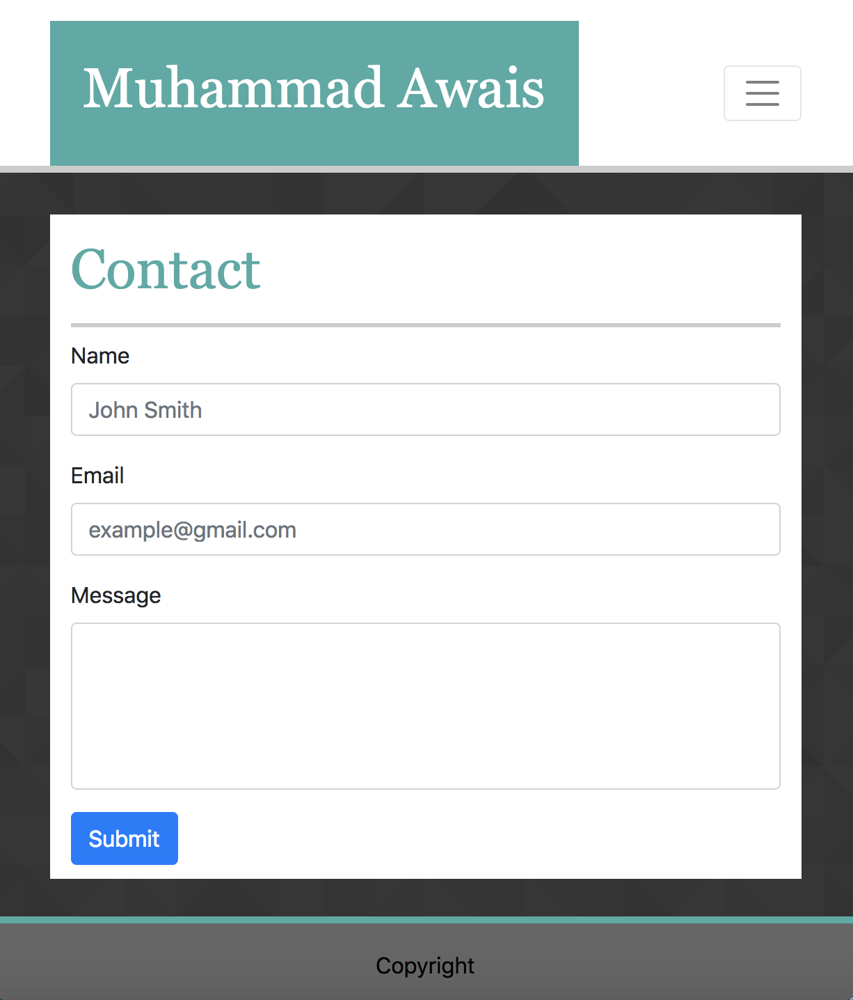

# Bootstrap-Portfolio

Portfoilo website using bootstrap with html and css

# Link to deployed site

[Bootstrap-Portfolio](https://mawais54013.github.io/Bootstrap-Portfolio/)

# Images




# Technology Used
- HTML
- CSS
- Boostrap

# Code Snippets

```
<head>
   
    <meta name="viewport" content="width=device-width, initial-scale=1, shrink-to-fit=no">

    <link rel="stylesheet" href="style.css">

    <link rel="stylesheet" href="https://stackpath.bootstrapcdn.com/bootstrap/4.1.3/css/bootstrap.min.css" integrity="sha384-MCw98/SFnGE8fJT3GXwEOngsV7Zt27NXFoaoApmYm81iuXoPkFOJwJ8ERdknLPMO" crossorigin="anonymous">

    <title>Bootstrap Portfolio</title>
  </head>
```
# Author 
[Muhammad Awais](https://github.com/mawais54013/Bootstrap-Portfolio)
